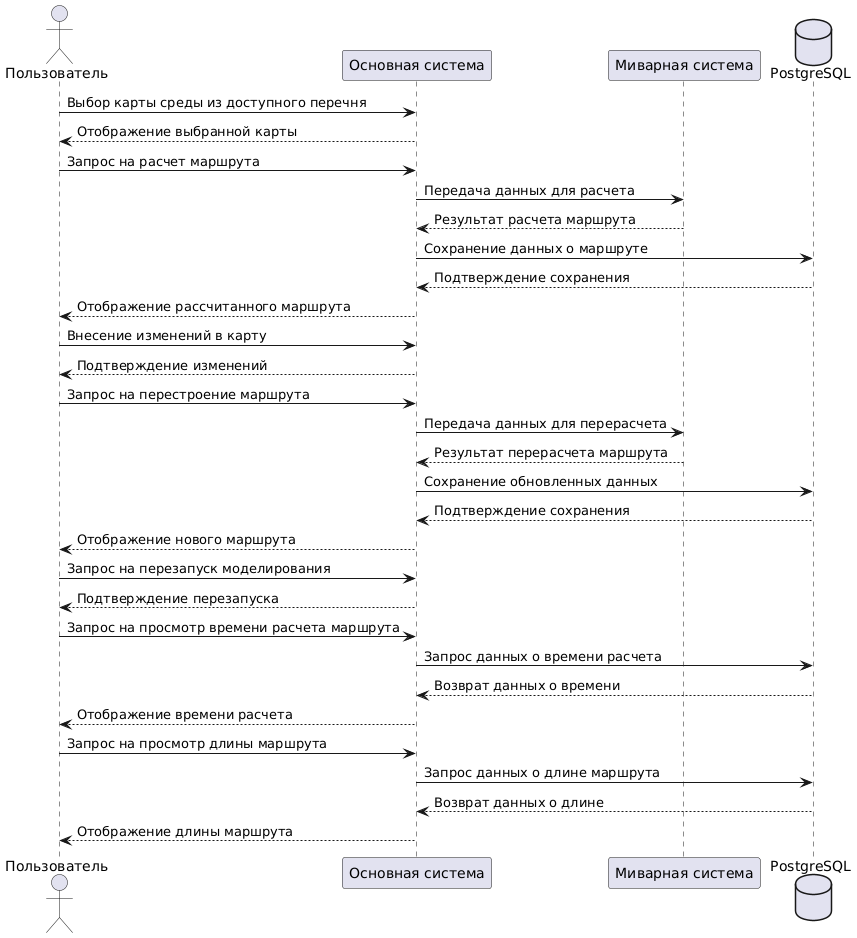
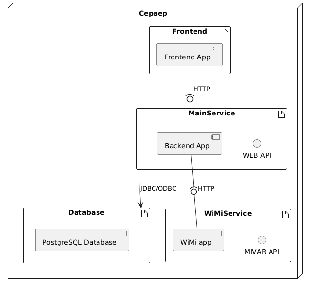

# Информационная система планирования маршрута автономного робота с применением миварных технологий
# !!!! TODO
Сейчас, если перезапустить сервис, не перезапуская контейнер с WiMi,
модели в сервисе не будут совпадать с моделями в WiMi. 
Варианты решения:
- использовать предсгенеренные модели из xml файлов, а не генерить при запуске сервиса
- проверять, если есть сгенеренные модели, то не генерировать новые
- проверять, если в WiMi уже есть модель с нашим id, то удалять ее и загружать новую
- перезапускать всегда сервис и WIMI вместе, используя docker-compose
## Как запустить сервер WiMi в контейнере:
1. Собрать образ ```docker build -t wimi_app .```
2. Запустить контейнер ```docker run -p 8092:8092 -t wimi_app```
3. Теперь можно отправлять запросы по адресу ```http://127.0.0.1:8092```\
   **Примечание:** Dockerfile должен находиться в одной директории с файлами WiMi.service и WiMi-0.1.7.deb

## Документация по работе сервиса планирования маршрута
1. [API](MivarAPI/README.md)

## Диаграммы




